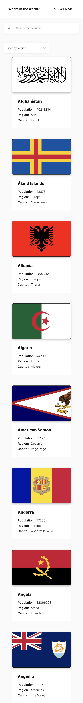
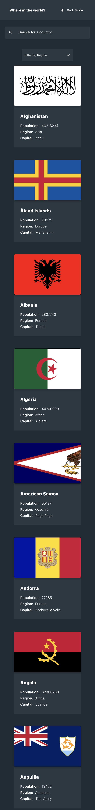
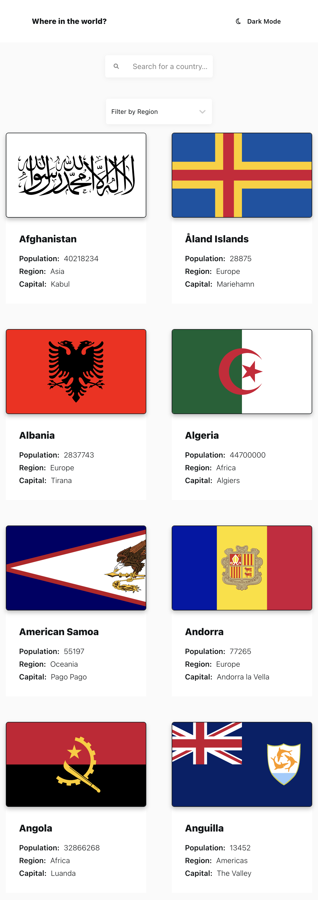
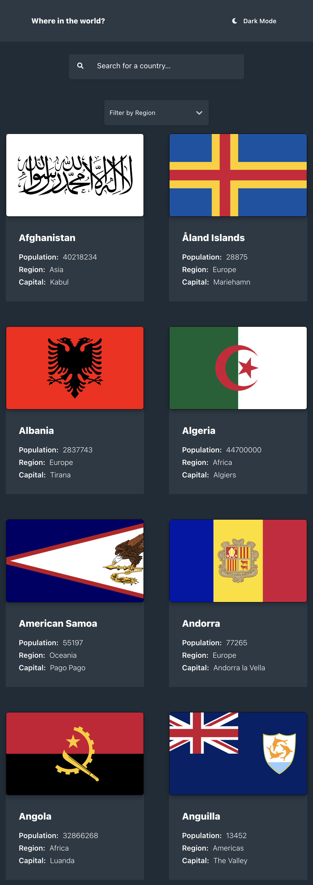
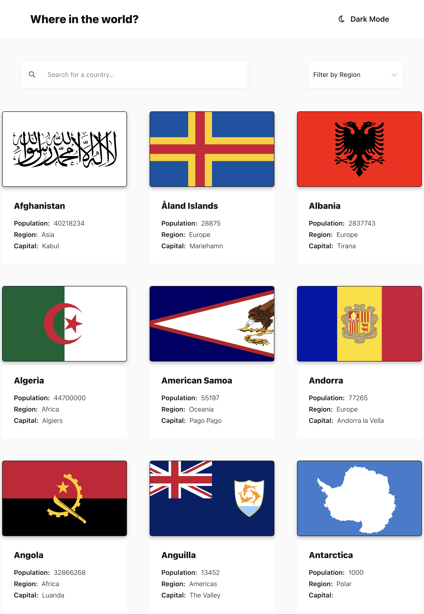
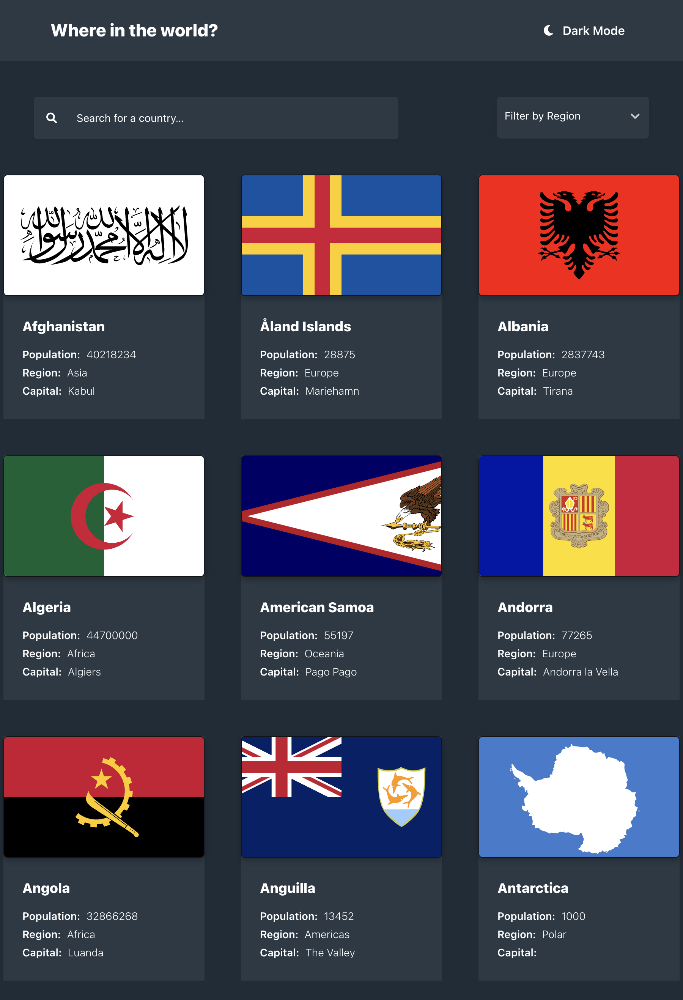
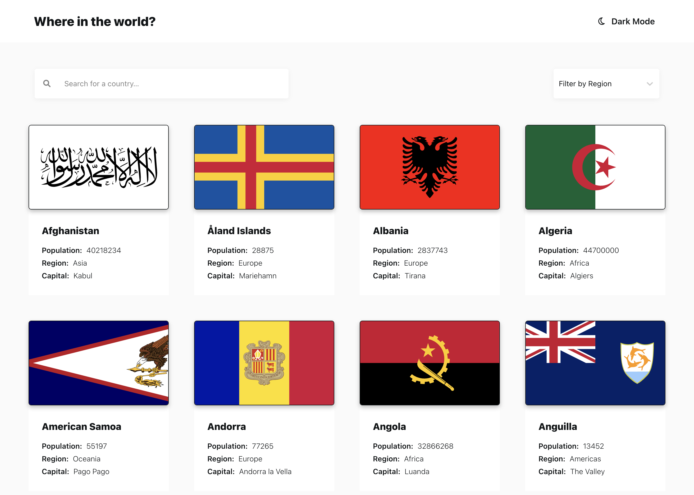
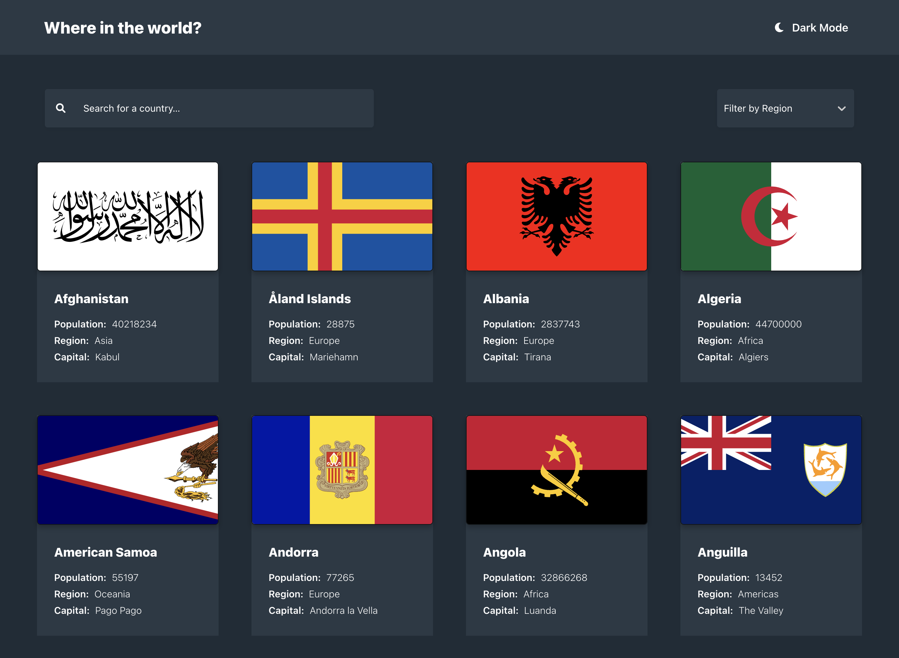

# Frontend Mentor - REST Countries API with color theme switcher solution

This is a solution to the [REST Countries API with color theme switcher
challenge on Frontend Mentor](https://www.frontendmentor.io/challenges/rest-countries-api-with-color-theme-switcher-5cacc469fec04111f7b848ca).
Frontend Mentor challenges help you improve your coding skills by building
realistic projects.

## Table of contents

- [Overview](#overview)
  - [The challenge](#the-challenge)
  - [Screenshot](#screenshot)
  - [Links](#links)
- [My process](#my-process)
  - [Built with](#built-with)
  - [What I learned](#what-i-learned)
  - [Continued development](#continued-development)
- [Author](#author)
- [Acknowledgments](#acknowledgments)

**Note: Delete this note and update the table of contents based on what
sections you keep.**

## Overview

### The challenge

Users should be able to:

- See all countries from the API on the homepage
- Search for a country using an `input` field:
  - **CBS Addition**: Clicking on the 'Search for a country' `input` field will display a menu,
    listing all available countries. Upon selecting a country, the user will be
    presented with the Country's detail page.
- Filter countries by region:
  - **CBS Addition**: Choosing a region will filter the Country's listed by that selected region.
    Clearing the value will reset the view back to the original listing of all countries.
- Click on a country to see more detailed information on a separate page
- Click through to the border countries on the detail page
- Toggle the color scheme between light and dark mode:
  - **CBS Addition**: The application will check LocalStorage to see if a `mode` has been saved for the application already.
  If not, it will check the `system`'s mode to determine if a theme has been set. A system theme will render
  the application with that theme. If not, it will default to `light` theme.

### Screenshots

#### Mobile

<details>
  <summary>Light</summary>
  
</details>

<details>
  <summary>Dark</summary>
  
</details>

#### Tablet-ish (2 columns)

<details>
  <summary>Light</summary>
  
</details>

<details>
  <summary>Dark</summary>
  
</details>

#### Tablet-ish (3 columns)

<details>
  <summary>Light</summary>
  
</details>

<details>
  <summary>Dark</summary>
  
</details>

#### Desktop

<details>
  <summary>Light</summary>
  
</details>

<details>
  <summary>Dark</summary>
  
</details>

### Links

- Solution URL: [Solution @ Frontend Mentor](https://www.frontendmentor.io/solutions/rest-countries-api-reactreactselectdark-themeresponsive-ui-nq8t6-r3Cb)
- Live Site URL: [REST Countries @ Vercel](https://rest-countries-cbserra.vercel.app/)

## My process

### Built with

- [Create-React-App with Typescript Template](https://create-react-app.dev/docs/adding-typescript)
- CSS custom properties
- [React Select](https://react-select.com/home) Library
- [Flexbox](https://css-tricks.com/snippets/css/a-guide-to-flexbox/)
- [CSS Grid](https://css-tricks.com/snippets/css/complete-guide-grid/)
- Mobile-first workflow

**Note: These are just examples. Delete this note and replace
the list above with your own choices**

### What I learned

I followed a few blog posts, discussing `useContext` hook and `createContext`. Implemented following these posts/sandboxes:

- [Building Dark Mode in React: The Fun Way | JavaScript Works](https://javascript.works-hub.com/learn/building-dark-mode-in-react-the-fun-way-424f6)
- [Light/dark mode: React Implementation](https://dev.to/ayc0/light-dark-mode-react-implementation-3aoa#defining-the-context)
  - [Code Sandbox](https://codesandbox.io/s/themes-tbclf?file=/src/theme.tsx)

I really should learn about `Routes` in React, but in place of that, I used an array to 
build 'history' of when a user clicks through the Borders to view other Countries, the array
will allow them to go 'Back' through the countries they've visited:

```js
// CountryDetail.tsx
...
<h2>Border Countries:</h2>
{country.borders?.map((border, index) => 
    <span 
        key={index} 
        className='border-value' 
        onClick={() => {
            setPrevSelectedCountries((prevValues: Country[]) => [...prevValues, country])
            setSelectedCountry(() => alphaNames[border])
        }}
        >
            {alphaNames[border].name}
        </span>
)} 
...
// BackButton.tsx
...
const BackButton = (props: { 
    prevSelectedCountries: Country[],
    setSelectedCountry: any,
    setPrevSelectedCountries: any
}) => {
    return (
        <button 
            className='back-button' 
            onClick={() => props.setSelectedCountry(props.prevSelectedCountries?.pop())}
        >
            <i className="fa-solid fa-arrow-left-long"></i>
            &nbsp;Back
        </button>
    )
}
```

### Continued development

- Learn about 'Routes' in React
- Caching, since the data we're requesting is unlikely to change regularly
- CSS: Improve code efficiency. Improve Responsive Design implementation so
it's less dependent on `@media` queries -- the layout should collapse and grow
smoothly.

## Author

- GitHUb - [Chris Serra](https://www.github.com/cbserra)
- Frontend Mentor - [@cbserra](https://www.frontendmentor.io/profile/cbserra)

## Acknowledgments

Thank you to the members of Frontend Mentor -- on both the site and Slack channel --
for their feedback and contributions which have inspired my own solutions.