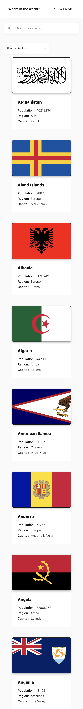
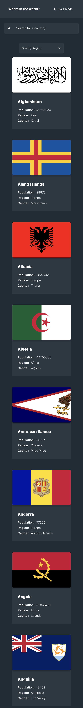
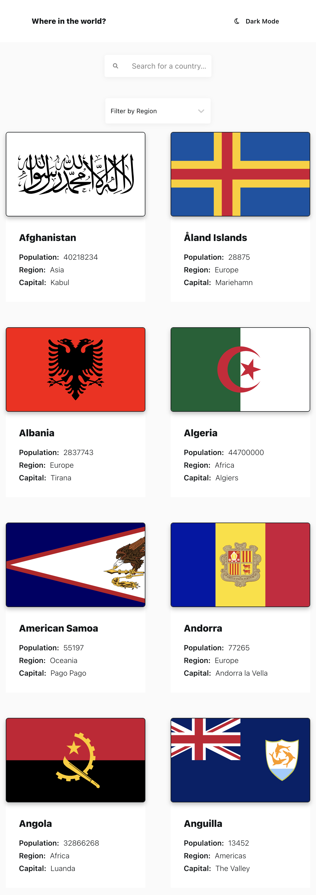
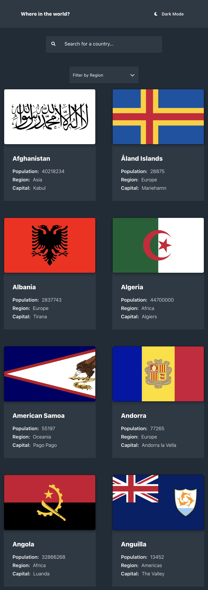
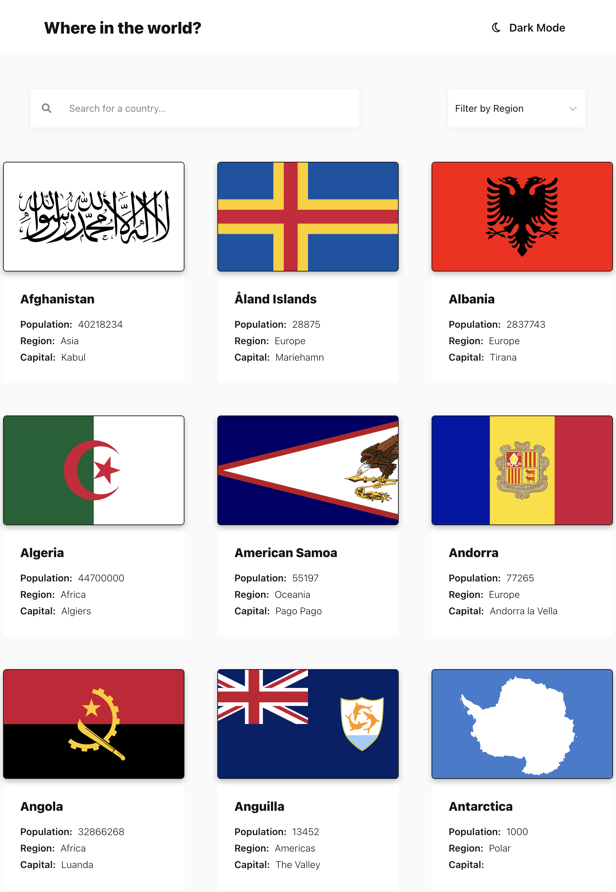
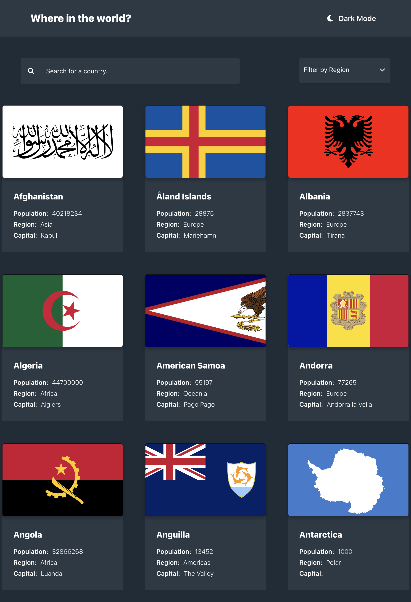
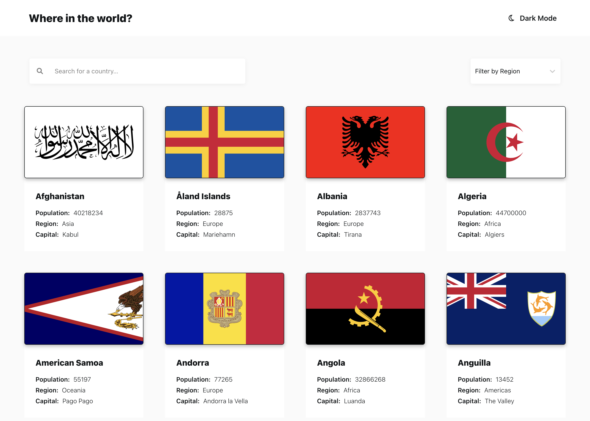
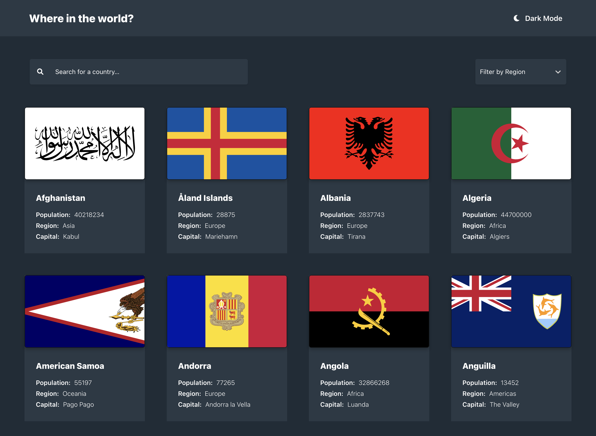

# Frontend Mentor - REST Countries API with color theme switcher solution

This is a solution to the [REST Countries API with color theme switcher
challenge on Frontend Mentor](https://www.frontendmentor.io/challenges/rest-countries-api-with-color-theme-switcher-5cacc469fec04111f7b848ca).
Frontend Mentor challenges help you improve your coding skills by building
realistic projects.

## Table of contents

- [Overview](#overview)
  - [The challenge](#the-challenge)
  - [Screenshot](#screenshot)
  - [Links](#links)
- [My process](#my-process)
  - [Built with](#built-with)
  - [What I learned](#what-i-learned)
  - [Continued development](#continued-development)
  - [Useful resources](#useful-resources)
- [Author](#author)
- [Acknowledgments](#acknowledgments)

**Note: Delete this note and update the table of contents based on what
sections you keep.**

## Overview

### The challenge

Users should be able to:

- See all countries from the API on the homepage
- Search for a country using an `input` field:
  - **CBS Addition**: Clicking on the 'Search for a country' `input` field will display a menu,
    listing all available countries. Upon selecting a country, the user will be
    presented with the Country's detail page.
- Filter countries by region:
  - **CBS Addition**: Choosing a region will filter the Country's listed by that selected region.
    Clearing the value will reset the view back to the original listing of all countries.
- Click on a country to see more detailed information on a separate page
- Click through to the border countries on the detail page
- Toggle the color scheme between light and dark mode:
  - **CBS Addition**: The application will check LocalStorage to see if a `mode` has been saved for the application already.
  If not, it will check the `system`'s mode to determine if a theme has been set. A system theme will render
  the application with that theme. If not, it will default to `light` theme.

### Screenshots

#### Mobile

<details>
  <summary>Light</summary>
  
</details>

<details>
  <summary>Dark</summary>
  
</details>

#### Tablet-ish (2 columns)

<details>
  <summary>Light</summary>
  
</details>

<details>
  <summary>Dark</summary>
  
</details>

#### Tablet-ish (3 columns)

<details>
  <summary>Light</summary>
  
</details>

<details>
  <summary>Dark</summary>
  
</details>

#### Desktop

<details>
  <summary>Light</summary>
  
</details>

<details>
  <summary>Dark</summary>
  
</details>

### Links

- Solution URL: [Solution @ Frontend Mentor](https://www.frontendmentor.io/solutions/rest-countries-api-reactreactselectdark-themeresponsive-ui-nq8t6-r3Cb)
- Live Site URL: [REST Countries @ Vercel](https://rest-countries-cbserra.vercel.app/)

## My process

### Built with

- [Create-React-App with Typescript Template](https://create-react-app.dev/docs/adding-typescript)
- CSS custom properties
- [React Select](https://react-select.com/home) Library
- [Flexbox](https://css-tricks.com/snippets/css/a-guide-to-flexbox/)
- [CSS Grid](https://css-tricks.com/snippets/css/complete-guide-grid/)
- Mobile-first workflow

**Note: These are just examples. Delete this note and replace
the list above with your own choices**

### What I learned

I followed a few blog posts, discussing `useContext` hook and `createContext`. Implemented following these posts/sandboxes:

- [Building Dark Mode in React: The Fun Way | JavaScript Works](https://javascript.works-hub.com/learn/building-dark-mode-in-react-the-fun-way-424f6)
- [Light/dark mode: React Implementation](https://dev.to/ayc0/light-dark-mode-react-implementation-3aoa#defining-the-context)
  - [Code Sandbox](https://codesandbox.io/s/themes-tbclf?file=/src/theme.tsx)

```html
<h1>Some HTML code I'm proud of</h1>
```

```css
.proud-of-this-css {
  color: papayawhip;
}
```

```js
const proudOfThisFunc = () => {
  console.log('🎉')
}
```

If you want more help with writing markdown, we'd recommend checking out
[The Markdown Guide](https://www.markdownguide.org/) to learn more.

**Note: Delete this note and the content within this section and replace
 with your own learnings.**

### Continued development

Use this section to outline areas that you want to continue
focusing on in future projects. These could be concepts you're still not
completely comfortable with or techniques you found useful that you want
to refine and perfect.

**Note: Delete this note and the content within this section and replace
 with your own plans for continued development.**

### Useful resources

- [Example resource 1](https://www.example.com) - This helped me for XYZ reason.
 I really liked this pattern and will use it going forward.
- [Example resource 2](https://www.example.com) - This is an amazing article
which helped me finally understand XYZ. I'd recommend it to anyone still
learning this concept.

**Note: Delete this note and replace the list above with resources that helped
 you during the challenge. These could come in handy for anyone viewing
 your solution or for yourself when you look back on this project in the future.**

## Author

- Website - [Add your name here](https://www.your-site.com)
- Frontend Mentor - [@yourusername](https://www.frontendmentor.io/profile/yourusername)
- Twitter - [@yourusername](https://www.twitter.com/yourusername)

**Note: Delete this note and add/remove/edit lines above based on what
links you'd like to share.**

## Acknowledgments

This is where you can give a hat tip to anyone who helped you out on
this project. Perhaps you worked in a team or got some inspiration
from someone else's solution. This is the perfect place to give them some credit.

**Note: Delete this note and edit this section's content as necessary.
If you completed this challenge by yourself, feel free to delete this section entirely.**
